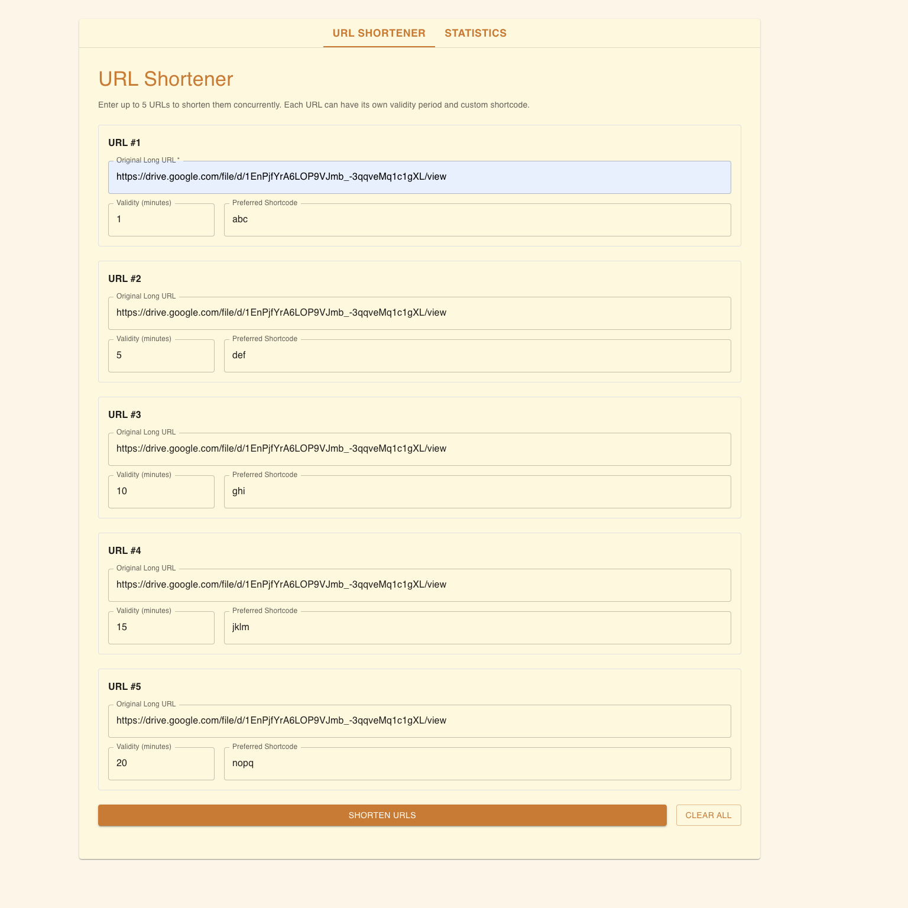

# URL Shortener - R22EH176

Full-stack URL shortener with React frontend and Node.js backend.

## Setup

**Backend:**

```bash
cd backend
npm install
npm start
```

**Frontend:**

```bash
cd frontend
npm install
npm start
```

## Usage

- Frontend: http://localhost:3000
- Backend: http://localhost:3001

## API

- `POST /shorturls` - Create short URL
- `GET /shorturls/{code}` - Get statistics
- `GET /{code}` - Redirect to original URL

## Screenshots

### Frontend




### Backend


**Student**: R22EH176 - Vennapusa Srinath Reddy
